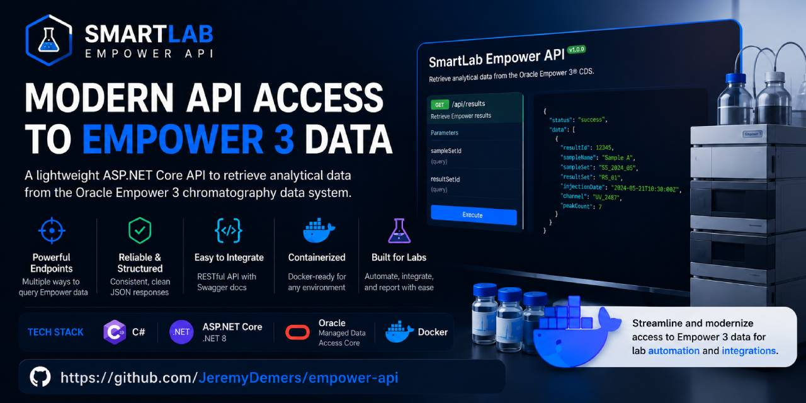

# SmartLab Empower API

SmartLab Empower API is an ASP.NET Core 8 web API for querying Empower 3 data stored in Oracle. It uses a small SQLite database to track the Empower schemas that contain data.



## Requirements

- [.NET 8 SDK](https://dotnet.microsoft.com/download/dotnet/8.0)
- Access to the required Oracle database
- Docker, if you want to run the application in a container

NuGet dependencies, including `Oracle.ManagedDataAccess.Core`, are restored automatically by the .NET CLI.

## Configuration

The application requires an Oracle connection string named `OracleConnection`. The values in the checked-in appsettings files are placeholders and must not be replaced with real credentials.

For local development, store the connection string with .NET user secrets:

```bash
cd src
dotnet user-secrets set "ConnectionStrings:OracleConnection" "YOUR_ORACLE_CONNECTION_STRING"
```

The application writes logs to `empower_access*.log`. Log files and local configuration files are excluded from Git.

## Run locally

From the repository root:

```bash
dotnet run --project src/smart-lab-empower-api.csproj
```

The default HTTP launch profile serves the application at:

- Swagger UI: <http://localhost:5254/swagger>
- API base path: `http://localhost:5254/api/EmpowerData`

## Run with Docker

Build the image from the repository root:

```bash
docker build -t empower-api src
```

Run it with the Oracle connection string supplied as an environment variable:

```bash
docker run --rm -p 5000:5000 \
  -e "ConnectionStrings__OracleConnection=YOUR_ORACLE_CONNECTION_STRING" \
  --name empower-api empower-api
```

Swagger will be available at <http://localhost:5000/swagger>.

The Docker image includes `src/database/data/resultsCheck.db`. This database is intentionally kept in Git; other local SQLite database files are ignored.

## API endpoints

All endpoints use `GET` requests and share the `/api/EmpowerData` base path.

| Endpoint | Query parameters | Purpose |
| --- | --- | --- |
| `/empower-data` | `pairs`, `year` | Fetch data for semicolon-separated sample-set/result-set ID pairs. |
| `/data-by-time-range` | `interval`, `period` | Fetch data for a relative time range. |
| `/result-ids-from-sample-name` | `sampleName`, `year` | Find result IDs associated with a sample name. |
| `/data-by-sample-name` | `sampleName`, `year` | Fetch data associated with a sample name. |
| `/data-by-result-id` | `resultId`, `year` | Fetch data for one result ID. |
| `/data-by-multiple-result-ids` | `resultId`, `year` | Fetch data for comma-separated result IDs. |
| `/instruments-in-use` | `year` | List instruments in use for a year. |
| `/all-instruments` | `year` | List all instruments for a year. |
| `/instrument_use-by-sampleset-year` | `year` | Fetch instrument usage by sample set for a year. |
| `/instrument_use-by-sampleset-year-and-month` | `year`, `month` | Fetch instrument usage by sample set for a month. |

### Examples

Fetch data for one or more sample-set/result-set pairs:

```text
GET /api/EmpowerData/empower-data?pairs=SAMPLE_SET_ID,RESULT_SET_ID;SAMPLE_SET_ID,RESULT_SET_ID&year=2024
```

Fetch data from the previous 30 days:

```text
GET /api/EmpowerData/data-by-time-range?interval=30&period=day
```

Find result IDs by sample name:

```text
GET /api/EmpowerData/result-ids-from-sample-name?sampleName=SAMPLE_NAME&year=2024
```

Fetch several result IDs:

```text
GET /api/EmpowerData/data-by-multiple-result-ids?resultId=RESULT_ID,RESULT_ID&year=2024
```

Swagger provides the complete interactive API documentation and response details.

## Author

Jeremy Demers
